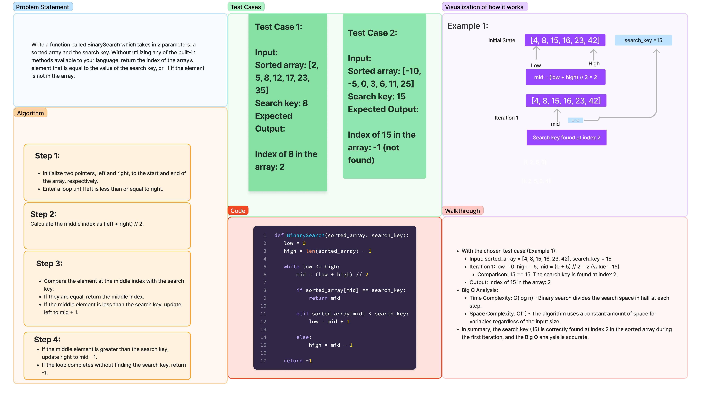

# Code Challenge: Binary Search in a Sorted 1D Array

Write a function called `binarySearch` which takes in 2 parameters: a sorted array and the search key.
Without utilizing any of the built-in methods available to your language, return the index of the array’s
element that is equal to the value of the search key, or `-1` if the element is not in the array.
The search algorithm used in the function should be a `binary search`.

[Link to code](./array_binary_search.py)

## Whiteboard Process



## Approach Taken for `binarySearch`

The `binarySearch` function utilizes a binary search algorithm to find the position of a target element
within a sorted array. Here's a breakdown of the approach:

1. **`Initialization`**:
   - Two variables, `low` and `high`, are set to point to the first and last elements of the array, respectively.
2. **`Iteration`**:
   - A loop iterates as long as `low` is less than or equal to `high`.
   - Within the loop:
     - The `mid` point of the current section is calculated using integer division for accurate indexing.
     - The value at the `mid` index is compared to the `search_key`:
     - If equal, the `mid` index is returned as the element's position.
     - If the `search_key` is smaller, the right half of the section is discarded by setting `high` to `mid - 1`.
     - If the `search_key` is larger, the left half is discarded by setting `low` to `mid + 1`.
3. **`Termination`**:
   - If the loop exits without finding the `search_key`, it means the entire array has been searched, and `-1` is
     returned to indicate its absence.

### Reasons for this approach:

- **Efficiency:** Binary search utilizes the sorted nature of the array to repeatedly eliminate half of the
  possible locations for the target element, leading to much faster search compared to linear search (traversing every element).
- **Simplicity:** The logic is relatively straightforward and easy to understand, making it a good choice for beginners and
  practical implementations.

## Big O Space/Time Complexity

### Space complexity

This implementation requires only constant additional space (O(1)) for the variables low, high, and mid.

### Time complexity

The number of comparisons performed in the loop is proportional to the logarithm of the array size `(log n)`.
Therefore, the time complexity is considered `O(log n)`, a significant improvement over linear search's `O(n)` complexity.
This approach strikes a balance between simplicity and efficiency, making it a widely used and powerful technique for
searching in sorted data structures.

## Solution

To run the code, you would pass in a sorted array as the argument in position 1 and a number value to be searched in
argument position 2 of the `binarySearch` function.

Examples:

```python
def BinarySearch(sorted_array, search_key):
   low = 0
   high = len(sorted_array) - 1

   while low <= high:
       mid = (low + high) // 2
       if sorted_array[mid] == search_key:
           return mid
       elif sorted_array[mid] < search_key:
           low = mid + 1
       else:
           high = mid - 1
   return -1

# Example 1:
sorted_array = [4, 8, 15, 16, 23, 42]
search_key = 15
result = BinarySearch(sorted_array, search_key)
print("Index of 15 in the array:", result)

# Example 2:
sorted_array = [-131, -82, 0, 27, 42, 68, 179]
search_key = 42
result = BinarySearch(sorted_array, search_key)
print("Index of 42 in the array:", result)
```

- [x] Top-level README “Table of Contents” is updated
- [x] README for this challenge is complete
  - [x] Summary, Description, Approach & Efficiency, Solution
  - [x] Picture of whiteboard
  - [x] Link to code
- [x] Feature tasks for this challenge are completed
- [ ] Unit tests written and passing
  - [ ] “Happy Path” - Expected outcome
  - [ ] Expected failure
  - [ ] Edge Case (if applicable/obvious)

### Stretch Goal

- [ ] What would you need to change if the array contained objects
      (sorted on a given property), and you were searching for certain
      property value? Write out the pseudocode.
