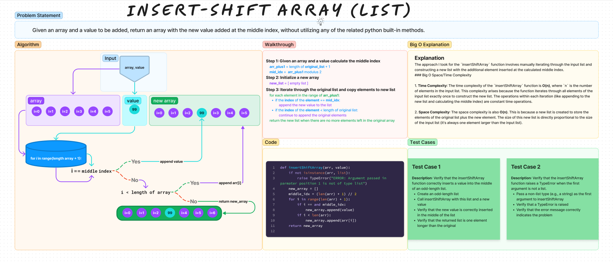

# Code Challenge: Array Reverse

Write a function called `insertShiftArray` which takes in an array and a value to be
added. Without utilizing any of the built-in methods available to your language, return
an array with the new value added at the middle index.

[Link to code](./insert_shift_array.py)

## Whiteboard Process



## Approach Taken for `insertShiftArray`

The approach I took for the `insertShiftArray` function involves manually iterating through the input list and constructing a new list with the additional element inserted at the calculated middle index. Here's why this approach was chosen:

1. **Manual Iteration and List Construction**: Since the use of built-in list methods like `insert` was prohibited, the function manually constructs a new list. This ensures compliance with the constraint and provides fine-grained control over the insertion process.

2. **Middle Index Calculation**: The middle index is calculated to accommodate both even and odd-length lists. For an even-length list, the new element is inserted after the current middle, maintaining a balance in the list.

3. **Type Checking**: The addition of a type check for the `arr` argument ensures that the function is robust and handles errors gracefully. This is a good practice in Python, ensuring that the function behaves predictably and provides clear feedback in case of incorrect usage.

## Big O Space/Time Complexity

1. **Time Complexity**: The time complexity of the `insertShiftArray` function is **O(n)**, where `n` is the number of elements in the input list. This complexity arises because the function iterates through all elements of the input list exactly once to construct the new list. The operations within each iteration (like appending to the new list and calculating the middle index) are constant time operations.

2. **Space Complexity**: The space complexity is also **O(n)**. This is because a new list is created to store the elements of the original list plus the new element. The size of this new list is directly proportional to the size of the input list (it's always one element larger than the input list).

In summary, the approach was chosen for its simplicity and adherence to the given constraints. The manual iteration allows for control over the insertion process, and the function is designed to handle both even and odd-length lists effectively. The time and space complexity are linear, which is expected given the need to traverse and copy the entire list to include the new element.

## Solution

To run the code, you would pass in a list in argument position 1 and a value in argument position 2 to the `insertShiftArray` function.

Examples:

```python
def insertShiftArray(arr, value):
    if not isinstance(arr, list):
        raise TypeError("The 'arr' argument must be a list.")
    middle_index = (len(arr) + 1) // 2
    new_arr = []

    for i in range(len(arr) + 1):
        if i == middle_index:
            new_arr.append(value)
        if i < len(arr):
            new_arr.append(arr[i])
    return new_arr

# Example 1:
print(insertShiftArray([1, 2, 3, 4, 5, 6], 99))  # Output: [1, 2, 99, 3, 4, 5]

# Example 2:
print(insertShiftArray([1, 2, 3, 4], 99))     # Output: [1, 2, 99, 3, 4]
```

- [x] Top-level README “Table of Contents” is updated
- [x] README for this challenge is complete
  - [x] Summary, Description, Approach & Efficiency, Solution
  - [x] Picture of whiteboard
  - [x] Link to code
- [x] Feature tasks for this challenge are completed
- [ ] Unit tests written and passing
  - [ ] “Happy Path” - Expected outcome
  - [ ] Expected failure
  - [ ] Edge Case (if applicable/obvious)

### Stretch Goal

- [ ] Write a second function that removes an element from the middle index and shifts
      other elements in the array to fill the new gap.
