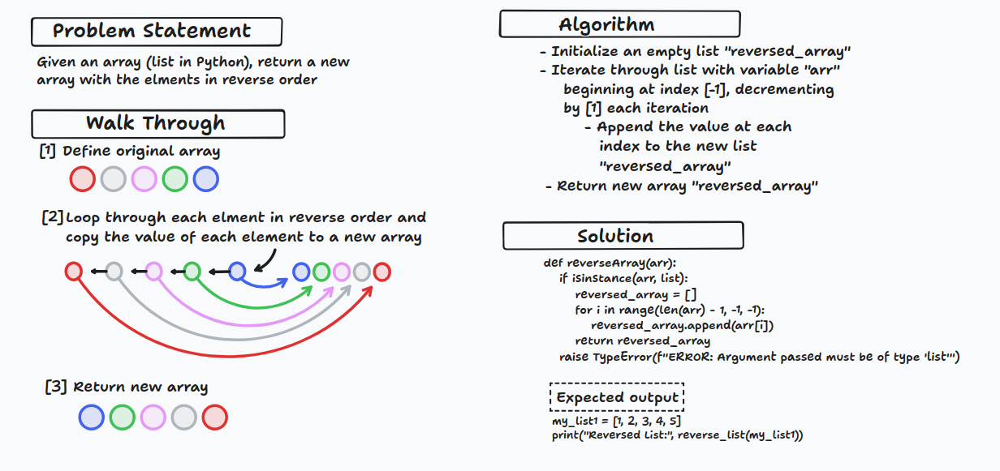

# Code Challenge: Array Reverse

Write a function called `reverseArray` which takes an array as an argument.
Without utilizing any of the built-in methods available to your language,
return an array with elements in **reversed order**.

[Link to code](./list_reverse.py)

## Whiteboard Process



## Approach & Efficiency

The code defines a function `reverseArray` that takes an input list (`arr`) and returns a
new list containing the elements of the input list in reverse order. The approach taken
here is to iterate through the input list in reverse using a `for` loop and append each
element to a new list (`reversed_array`).

### Explanation:

The loop iterates over the range `len(arr) - 1` to `0` (inclusive) with a step of `-1`,
effectively traversing the input list in reverse order.

For each index `i` in the reversed range, the corresponding element at index `i` in the
input list (`arr`) is appended to the `reversed_array`.

### Big O Time Complexity:

The time complexity of this approach is `O(n)`, where `n` is the length of the input list (`arr`).
This is because the loop iterates through each element in the input list once, and the time
required for each iteration is constant.

### Big O Space Complexity:

The space complexity is also `O(n)` because a new list (`reversed_array`) is created to store the
reversed elements, and its size is directly proportional to the size of the input list.

## Solution

To run the code, you would first define a list variable, then pass that variable as a parameter to
the `reverseArray` function.

Examples:

```python
def reverseArray(arr):
    if isinstance(arr, list):
        reversed_array = []
        for i in range(len(arr) - 1, -1, -1):
            reversed_array.append(arr[i])
        return reversed_array
    raise TypeError(f"ERROR: Argument passed must be of type 'list'")

# Example 1:
my_list1 = [1, 2, 3, 4, 5]
print("Example 1:", reverseArray(my_list1))

# Example 2:
my_list2 = ["apple", "banana", "cherry", "date", "fig", "grape", "kiwi"]
print("Example 2:", reverseArray(my_list2))

# Example 3:
my_list3 = [10, 20, 30, 40, 50, 60, 70, 80, 90, 100]
print("Example 3:", reverseArray(my_list3))
```

Output:

```bash
python3 list_reverse.py
Example 1: [5, 4, 3, 2, 1]
Example 2: ['kiwi', 'grape', 'fig', 'date', 'cherry', 'banana', 'apple']
Example 3: [100, 90, 80, 70, 60, 50, 40, 30, 20, 10]
```

- [x] Top-level README “Table of Contents” is updated
- [x] README for this challenge is complete
       - [x] Summary, Description, Approach & Efficiency, Solution
       - [x] Picture of whiteboard
       - [x] Link to code
- [x] Feature tasks for this challenge are completed
- [ ] Unit tests written and passing
       - [ ] “Happy Path” - Expected outcome
       - [ ] Expected failure
       - [ ] Edge Case (if applicable/obvious)
