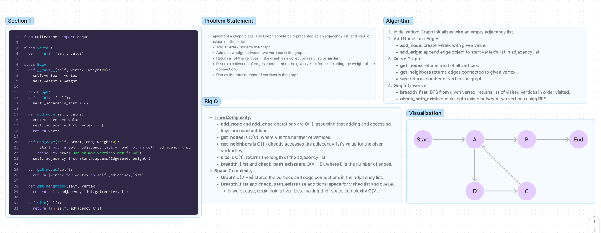

# Code Challenge 35: Graph

## Problem Domain

Implement a Graph class. The Graph should be represented as an adjacency list, and should include methods to:

1. Add a vertex/node to the graph.
2. Add a new edge between two vertices in the graph.
3. Return all of the vertices in the graph as a collection (set, list, or similar).
4. Return a collection of edges connected to the given vertex/node including the weight of the connection.
5. Return the total number of vertices in the graph.

[Link to code](../../data_structures/graph.py)

## Collaborators

> Stephanie Johnson
> Latherio Kidd

## Whiteboard Process

## Approach & Efficiency

My approach involves creating a data structure that can efficiently model a network of nodes (vertices) and their connections (edges). The `Graph` uses an **adjacency list**, a ***dictionary*** where keys are vertex objects and values are lists of edge objects. I chose this approach for its efficiency in adding vertices and edges, and in retrieving a vertex's neighbors.

### Big O Space/Time Complexity

- **Time Complexity**:
  - `add_node` and `add_edge` operations are `O(1)`, assuming that adding and accessing keys are average case constant time.
  - `get_nodes` is `O(V)`, where `V` is the number of vertices, since it iterates over all vertices.
  - `get_neighbors` is `O(1)`, as it directly accesses the adjacency list's value for the given vertex key.
  - `size` is `O(1)`, returning the length of the adjacency list.
  - `breadth_first` and `check_path_exists` are `O(V + E)`, where `E` is the number of edges.

- **Space Complexity**:
  - The space complexity of the graph is `O(V + E)` to store the vertices and their edge connections in the adjacency list.
  - The `breadth_first` and `check_path_exists` methods also use additional space for the visited list and queue.
  - Both `breadth_first` and `check_path_exists`, in the worst case, could hold all vertices, making their space complexity `O(V)`.

## Solution

1. **Initialization**: The `Graph` class initializes with an empty adjacency list.

2. **Adding Nodes and Edges**:
   - To add a node, create a `Vertex` with the given value, add it to the adjacency list with an empty list for edges, and return the vertex.
   - To add an edge, ensure both the start and end vertices exist, then append an `Edge` object to the start vertex's list in the adjacency list.

3. **Querying the Graph**:
   - `get_nodes` returns a list of all vertices.
   - `get_neighbors` returns the edges connected to a given vertex, effectively listing its neighbors.
   - `size` returns the number of vertices in the graph.

4. **Graph Traversal**:
   - `breadth_first` performs a breadth-first search starting from a given vertex, returning a list of visited vertices in the order they were visited.
   - `check_path_exists` checks for the existence of a path between two vertices using a breadth-first search approach, returning `True` if a path exists, otherwise `False`.

## Test Cases

1. Test Graph Existence
   - Verify that the `Graph` class is defined and can be instantiated.
   - **Method**: Instantiate a `Graph` object and assert its existence.
   - **Expected Outcome**: The graph object is successfully created.

2. Test Graph Size is Empty
   - Verify that the size method correctly returns 0 for a new, empty graph.
   - **Method**: Instantiate a new graph and check its size without adding any nodes.
   - **Expected Outcome**: The size of the graph is 0.

3. Test Graph Size is Non-Empty
   - Ensure the size method correctly reflects the number of nodes in the graph.
   - **Method**: Add a node to the graph and verify the size.
   - **Expected Outcome**: The size of the graph is 1 after adding one node.

4. Test Case 6: Self Loop
   - Verify the ability to add an edge from a node to itself (self-loop).
   - **Method**: Add a node and create an edge from the node to itself with a weight of 10.
   - **Expected Outcome**: The self-loop is successfully created with the correct weight.

5. Test Add Edge with Non-existent Start Node
   - Test the graph's behavior when trying to add an edge with a start node that does not exist in the graph.
   - **Method**: Attempt to add an edge using a start node that hasn't been added to the graph.
   - **Expected Outcome**: A `KeyError` is raised.

6. Test Add Edge with Non-existent End Node
   - Test the graph's behavior when trying to add an edge with an end node that does not exist in the graph.
   - **Method**: Attempt to add an edge using an end node that hasn't been added to the graph.
   - **Expected Outcome**: A `KeyError` is raised.

### Checklist

- [x] Top-level README “Table of Contents” is updated
- [x] README for this challenge is complete
  - [x] Summary, Description, Approach & Efficiency, Solution
  - [x] Picture of whiteboard
  - [x] Link to code
- [x] Feature tasks for this challenge are completed
- [x] Unit tests written and passing
  - [x] “Happy Path” - Expected outcome
  - [x] Expected failure
  - [x] Edge Case (if applicable/obvious)
