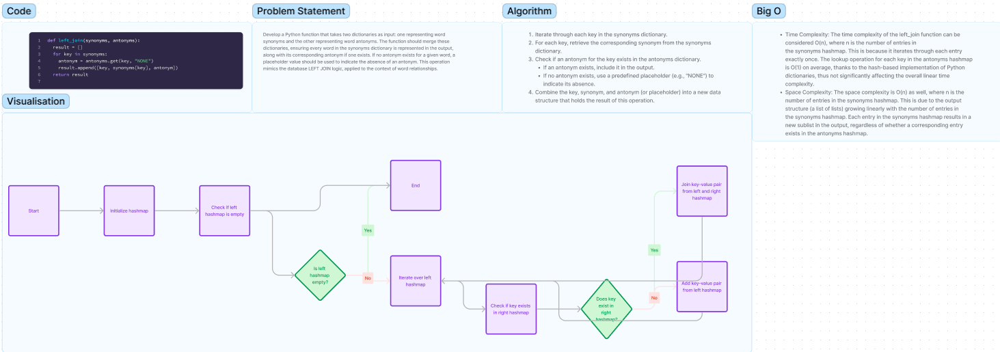

# Code Challenge 33: Hashtable Left Join

## Problem Domain

Develop a Python function that takes two dictionaries as input: one representing word synonyms and the other representing word antonyms. The function should merge these dictionaries, ensuring every word in the synonyms dictionary is represented in the output, along with its corresponding antonym if one exists. If no antonym exists for a given word, a placeholder value should be used to indicate the absence of an antonym. This operation mimics the database LEFT JOIN logic, applied to the context of word relationships.

[Link to code](../../code_challenges/hashtable_left_join.py)

## Collaborators

> Stephanie Johnson
> Latherio Kidd

## Whiteboard Process



## Approach & Efficiency

The `left_join` function is designed to merge two hashmaps based on a LEFT JOIN logic, where every key-value pair from the first hashmap (`synonyms`) is combined with the corresponding value from the second hashmap (`antonyms`), if it exists. If there's no corresponding value in the second hashmap, a placeholder value ("NONE") is used. This approach ensures that all entries from the `synonyms` hashmap are preserved in the output, while entries from the `antonyms` hashmap are included only when they have a matching key in the `synonyms` hashmap.

The function iterates once through each key-value pair in the `synonyms` hashmap, making a single pass operation. For each key, it checks for a corresponding value in the `antonyms` hashmap using a dictionary lookup, which is generally efficient.

### Big O Space/Time Complexity

- **Time Complexity**: The time complexity of the `left_join` function can be considered `O(n)`, where `n` is the number of entries in the `synonyms` hashmap. This is because it iterates through each entry exactly once. The lookup operation for each key in the `antonyms` hashmap is `O(1)` on average, thanks to the hash-based implementation of Python dictionaries, thus not significantly affecting the overall linear time complexity.

- **Space Complexity**: The space complexity is `O(n)` as well, where `n` is the number of entries in the `synonyms` hashmap. This is due to the output structure (a list of lists) growing linearly with the number of entries in the `synonyms` hashmap. Each entry in the `synonyms` hashmap results in a new sublist in the output, regardless of whether a corresponding entry exists in the `antonyms` hashmap.

## Solution

1. **Input**: Two hashmaps, where the first contains key-value pairs of words and their synonyms, and the second contains key-value pairs of words and their antonyms.
   - Process: Iterate through each entry in the first hashmap (`synonyms`), look up the corresponding entry in the second hashmap (`antonyms`), and combine them into a new data structure based on LEFT JOIN logic. If no corresponding entry is found in the `antonyms` hashmap, append "NONE" to indicate the absence of an antonym.
   - Output: A new data structure (list of lists) where each sub-list contains a word from the `synonyms` hashmap, its synonym, and either its antonym from the `antonyms` hashmap or "NONE" if no antonym exists.

### Example Usage

```python
synonyms = {
        "diligent": "employed",
        "fond": "enamored",
        "guide": "usher",
        "outfit": "garb",
        "wrath": "anger",
    }

antonyms = {
    "diligent": "idle",
    "fond": "averse",
    "guide": "follow",
    "flow": "jam",
    "wrath": "delight",
}

print(left_join(synonyms, antonyms))

#Output:
[
    ["diligent", "employed", "idle"],
    ["fond", "enamored", "averse"],
    ["guide", "usher", "follow"],
    ["outfit", "garb", "NONE"],
    ["wrath", "anger", "delight"],
]
```

### Checklist

- [x] Top-level README “Table of Contents” is updated
- [x] README for this challenge is complete
  - [x] Summary, Description, Approach & Efficiency, Solution
  - [x] Picture of whiteboard
  - [x] Link to code
- [x] Feature tasks for this challenge are completed
- [x] Unit tests written and passing
  - [x] “Happy Path” - Expected outcome
  - [x] Expected failure
  - [x] Edge Case (if applicable/obvious)
