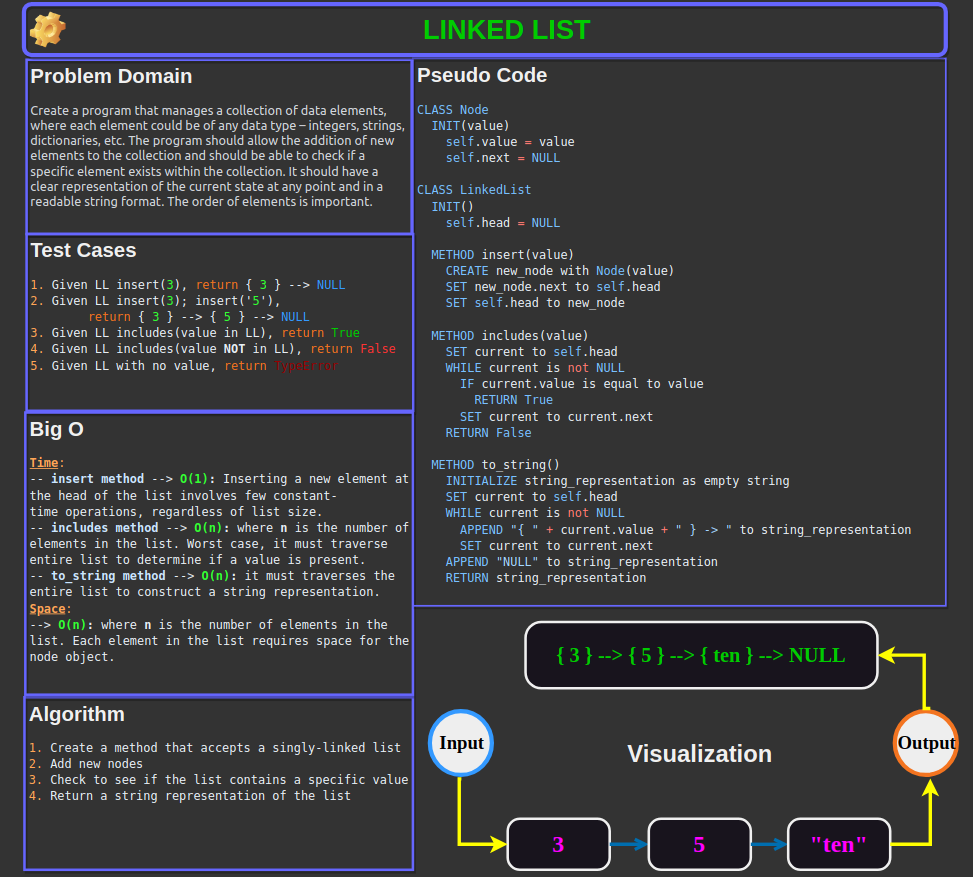

# Code Challenge: Linked List


In this **singly-linked list** challenge, we created a **`Node`** class that has properties for the value stored in
the Node, and a pointer to the next Node. We then created a **`LinkedList`** class that includes
a **`head`** property. Upon instantiation of the `LinkedList` class, an empty linked list is created. The linked
list has three methods: **`insert`** - which inserts a node, **`includes`** - which checks for the existence
of a specific node, and **`to_string`** - which converts the list to a string.

[Link to code](./linked_lists/linked_list.py)

## Whiteboard Process



## Approach & Efficiency

### Explanation

I implemented a basic **singly linked list** using a *class-based* approach as was required.
The choice of this approach and its implications in terms of time and space complexity are
as follows:

- **Data Structure Choice**: The linked list is well-suited for situations where elements are
  frequently inserted or removed. By choosing a linked list, we avoid the overhead of resizing,
  which is common in *array-based* structures like Python lists.

- **Data Classes**: I used Python's `@dataclass` decorator to simplify the class definitions. This
  feature automatically generates common methods like `__init__` and `__repr__`, reducing boilerplate
  code and enhancing readability.

- **Singly Linked List**: Each node has a **value** and a **pointer** to the next node, but not to the
  previous one (*making it a* ***singly linked list***). This design is simpler and uses less memory per node
  compared to a ***doubly linked list***, but at the cost of some operations *(like backwards traversal)*.

### Big O Time Complexity

#### Insert

The `insert` method has **O(1)** time complexity. Inserting a new element at the head of the list involves only
a few **constant-time** operations, regardless of the list's size.

#### Includes

The `includes` method has **O(n)** time complexity, where **n** is the number of elements in the list. In the worst
case, it needs to traverse the entire list to find the value or determine that the value is not present.

#### To String

The `to_string` method also has **O(n)** time complexity, as it traverses the entire list to construct the string
representation.

### Big O Space Complexity

The space complexity of the linked list is **O(n)**, where **n** is the number of elements in the list. Each element
in the list requires space for the node object (*storing the value and the pointer to the next node*).

## Solution

To run the code, you would do the following:

1. Instantiate a `LinkedList` object by assigning it to a variable:`linked_list = LinkedList()`.
2. Add values to the linked list instance by calling the `insert` method: `linked_list.insert(1)`.
3. Check to see if the list contains a value by calling the `includes` method: `linked_list.includes(24)`.
4. Convert the linked list to a string (*to print to the console, etc.,*) by calling the `to_string` method on the object.

### Example Usage

Input:

```python
# Example usage of the LinkedList class
linked_list = LinkedList()
linked_list.insert(3)
linked_list.insert(2)
linked_list.insert(1)

print("Linked List:", linked_list.to_string())
print("Includes 2:", linked_list.includes(2))
print("Includes 4:", linked_list.includes(4))
```

Output:

```bash
Linked List: { 1 } -> { 2 } -> { 3 } -> NULL
Includes 2: True
Includes 4: False
```

- [x] Top-level README “Table of Contents” is updated
- [x] README for this challenge is complete
  - [x] Summary, Description, Approach & Efficiency, Solution
  - [x] Picture of whiteboard
  - [x] Link to code
- [x] Feature tasks for this challenge are completed
- [x] Unit tests written and passing
  - [x] “Happy Path” - Expected outcome
  - [x] Expected failure
  - [x] Edge Case (if applicable/obvious)

---

## Testing: About Pytest Fixtures

### Fixture Definition

I incorporated the `@pytest.fixture` decorator from the pytest module to create and mark the `linked_list()` test function as a **fixture**. It creates a new `LinkedList` instance for each test that requests it.

### Fixture Usage

Test functions now include `linked_list` as an argument. Pytest automatically calls the fixture function and passes its return value to the test function.

### Benefits

- **Reusability**: The *`linked_list` fixture* is reused across multiple tests, reducing code duplication.
- **Setup Isolation**: Each test gets a fresh, independent `LinkedList` instance, ensuring tests don't interfere with each other.
- **Readability**: Tests become more focused on the specific behavior being tested, as setup logic is handled in the fixture.
- **Maintainability**: Changes to the setup process can be made in one place (*the fixture*), rather than in multiple test functions.

```python
@pytest.fixture
def linked_list():
    """Creates a new linked list instance for each test."""
    return LinkedList()

def test_insert_single(linked_list):
    """Tests the insertion of a single element."""
    linked_list.insert(1)
    assert linked_list.head.value == 1
    assert linked_list.head.next is None
#...
```
