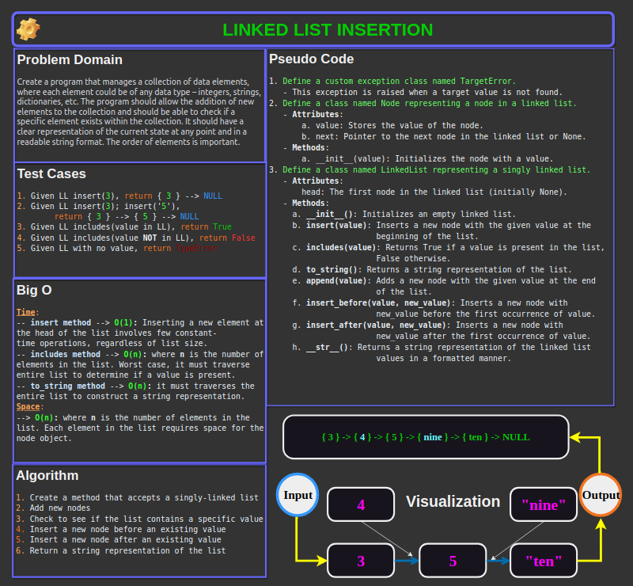

# Code Challenge 06: Linked List Insertions

In this **linked list** challenge, we extend a Linked List to allow various insertion methods.

[Link to code](./linked_list_insertion/linked_list_insertion.py)

## Whiteboard Process



## Approach & Efficiency

### Explanation

The approach taken in the `insert_after` and `insert_before` methods is a straightforward traversal of the singly linked list to find the node with the specified value (`value`). Once the node is found, a new node with `new_value` is inserted. This approach is chosen for its simplicity and directness in addressing the task. It is easy to understand, implement, and it works well for the fundamental operation of inserting an element in a linked list.

### Why This Approach?

1. **Simplicity:** Traversing a linked list to find a node and inserting a new node after it is a fundamental operation in linked list manipulation. It's a basic and intuitive approach that fits well with the nature of singly linked lists.

2. **Directness:** This method directly traverses the list, inspecting each node's value without any additional complexity, making it suitable for a singly linked list where sequential access is the only option.

### Big O Space/Time Complexity

1. **Time Complexity:** The time complexity of this approach is **O(n)**, where n is the number of nodes in the linked list. In the worst-case scenario, the method traverses the entire list to find the node with the specified value or to determine that the value is not present in the list.

2. **Space Complexity:** The space complexity is **O(1)**. The method uses a constant amount of space regardless of the size of the input list. The space used for the `current` pointer and the new node (`new_node`) does not scale with the size of the linked list, thus keeping the space complexity constant.

## Solution

To run the code, you would do the following:

1. Instantiate a `LinkedList` object by assigning it to a variable:`linked_list = LinkedList()`.
2. Add values to the linked list instance by calling the `insert` method: `linked_list.insert(1)`.
3. Check to see if the list contains a value by calling the `includes` method: `linked_list.includes(24)`.
4. Insert a new node after an existing value by calling the `insert_after` method passing the existing value and the new value.
5. Insert a new node before an existing value by calling the `insert_after` method passing the existing value and the new value.
6. Append a new node by calling the `append` method and passing in the value of the new node.

### Example Usage

Input:

```python
# Example usage of the LinkedList class
linked_list = LinkedList()
linked_list.insert(3)
linked_list.insert(2)
linked_list.insert(1)
linked_list.append(10)
linked_list.insert_before(10, 5)
linked_list.insert_after(10, 15)
linked_list.insert_after(15, 25)

print("Linked List:", linked_list.to_string())
print("Includes 2:", linked_list.includes(2))
print("Includes 4:", linked_list.includes(4))
```

- [x] Top-level README “Table of Contents” is updated
- [x] README for this challenge is complete
  - [x] Summary, Description, Approach & Efficiency, Solution
  - [x] Picture of whiteboard
  - [x] Link to code
- [x] Feature tasks for this challenge are completed
- [x] Unit tests written and passing
  - [x] “Happy Path” - Expected outcome
  - [x] Expected failure
  - [x] Edge Case (if applicable/obvious)
