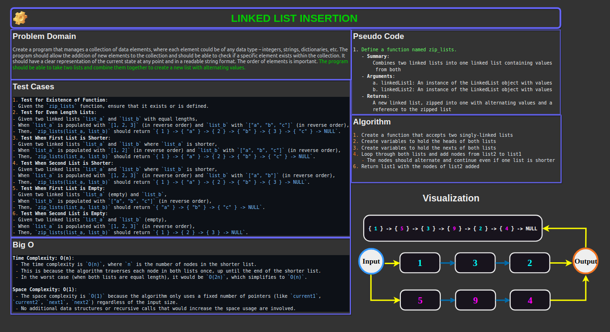

# Code Challenge 06: Linked List k-th value from the end

In this **linked list Zip** challenge, we extend a Linked List to allow the zipping of two linked lists into on list containing nodes from both lists, in alternating fashion.

[Link to code](./linked_list_zip/linked_list_zip.py)

## Whiteboard Process



## Approach & Efficiency

### Approach Taken

1. **In-Place Modification**:
   - The algorithm zips the two lists by alternating their nodes without creating new nodes.
     - It modifies the `next` pointers of the existing nodes in the lists to interweave them.
   - I chose this approach to keep the space complexity minimal.
     - Since it doesn't create new nodes or data structures, it utilizes only the existing nodes in the input lists.

2. **Handling Different Lengths**:
   - The algorithm includes a check to handle cases where one list is shorter than the other.
     - When the end of the shorter list is reached, the algorithm appends the remaining part of the longer list to the zipped list.

3. **Edge Cases**:
   - The solution accounts for edge cases, such as when one or both lists are empty.

### Why This Approach?

The primary reason for choosing in-place modification is to keep the space complexity at `O(1)`, as the problem statement emphasizes minimizing additional space.
This approach is also straightforward and efficient, allowing the zipping of the lists in a single pass through the nodes.

### Big O Space/Time Complexity

- **Time Complexity: O(n)**:
  - The time complexity is `O(n)`, where `n` is the number of nodes in the shorter list.
    - This is because the algorithm traverses each node in both lists once, up until the end of the shorter list.
  - In the worst case (when both lists are equal length), it would be `O(2n)`, which simplifies to `O(n)`.

- **Space Complexity: O(1)**:
  - The space complexity is `O(1)` because the algorithm only uses a fixed number of pointers (like `current1`, `current2`, `next1`, `next2`) regardless of the input size.
  - No additional data structures or recursive calls that would increase the space usage are involved.

## Solution

To run the code, you would do the following:

1. **Instantiate Two Linked List Objects**:
   - List A: `1 -> 3 -> 2 -> null`
   - List B: `5 -> 9 -> 4 -> null`

2. **Pass Linked Lists to The `zip_lists` Function**:
   - `zip_lists(A,B)`

### Example Usage

Input:

```python
# Create two linked lists
list_a = LinkedList()
list_b = LinkedList()

# Populate list_a with 1, 2, 3
for value in [3, 2, 1]:
    list_a.insert(value)

# Populate list_b with 'a', 'b', 'c'
for value in ['c', 'b', 'a']:
    list_b.insert(value)

# Zip the two lists
zipped_list = zip_lists(list_a, list_b)

# Print the zipped list
print(str(zipped_list))

# OUTPUT
# { 1 } -> { 'a' } -> { 2 } -> { 'b' } -> { 3 } -> { 'c' } -> NULL
```

### Checklist

- [x] Top-level README “Table of Contents” is updated
- [x] README for this challenge is complete
  - [x] Summary, Description, Approach & Efficiency, Solution
  - [x] Picture of whiteboard
  - [x] Link to code
- [x] Feature tasks for this challenge are completed
- [x] Unit tests written and passing
  - [x] “Happy Path” - Expected outcome
  - [x] Expected failure
  - [x] Edge Case (if applicable/obvious)
