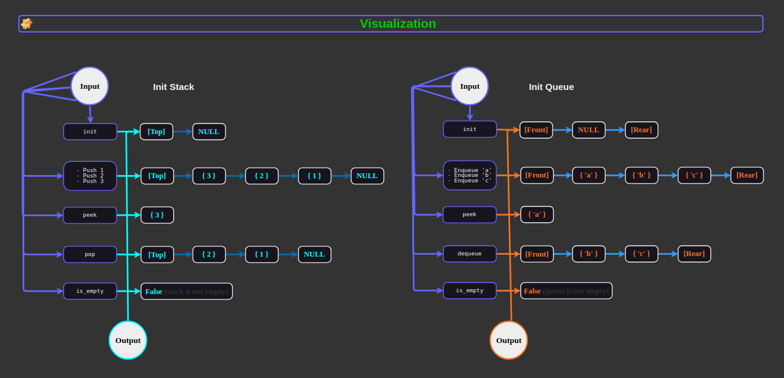
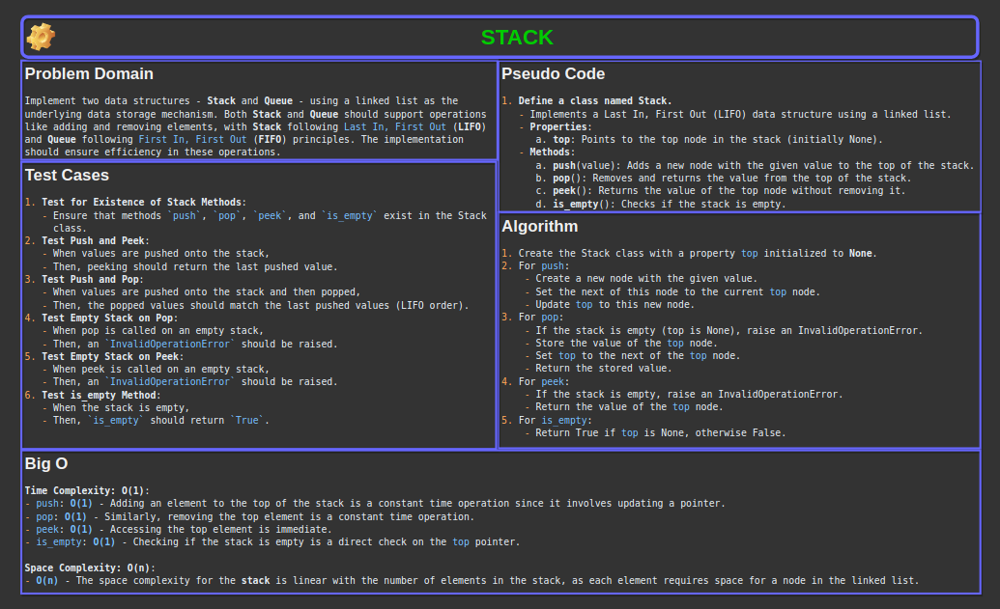
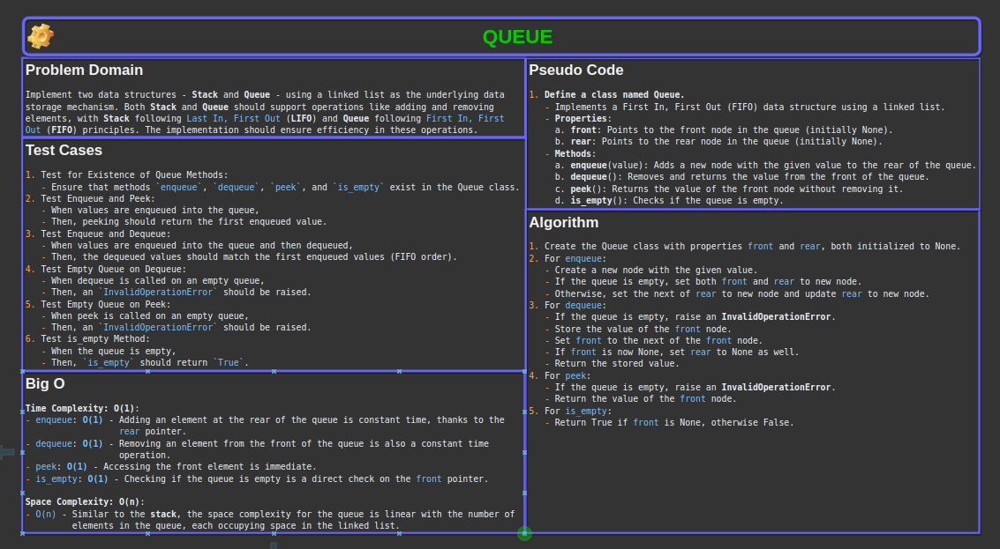

# Code Challenge 06: Linked List k-th value from the end

Implement two data structures - **Stack** and **Queue** - using a linked list as the underlying data storage mechanism. Both **Stack** and **Queue** should support operations like adding and removing elements, with **Stack** following `Last In, First Out` (**LIFO**) and Queue following `First In, First Out` (**FIFO**) principles. The implementation should ensure efficiency in these operations.

[Link to code: stack](./stack_and_queue/stack.py)
[Link to code: queue](./stack_and_queue/queue.py)

## Whiteboard Process





## Approach & Efficiency

For the implementation of the `Stack` and `Queue` classes using a linked list as the underlying data structure, I took a an approach that leverages the inherent properties of linked lists to efficiently perform **stack** and **queue** operations.

### Stack Implementation

I implemented the **stack** using a singly linked list with a `top` pointer. The `push` operation adds elements to the front of the linked list, and the `pop` operation removes elements from the front.
This approach takes advantage of the linked list's ability to efficiently add and remove elements from the beginning without shifting other elements.

#### Stack Time Complexity

- `push`: `O(1)` - Adding an element to the top of the stack is a constant time operation since it involves updating a pointer.
- `pop`: `O(1)` - Similarly, removing the top element is a constant time operation.
- `peek`: `O(1)` - Accessing the top element is immediate.
- `is_empty`: `O(1)` - Checking if the stack is empty is a direct check on the `top` pointer.

#### Stack Space Complexity

`O(n)`
    - The space complexity for the **stack** is linear with the number of elements in the stack, as each element requires space for a node in the linked list.

### Queue Implementation

I implemented the **queue** using a singly linked list with `front` and `rear` pointers. The `enqueue` operation adds elements to the end of the list (using the `rear` pointer), and the `dequeue` operation removes elements from the front (using the `front` pointer).
This ensures that both **enqueue** and **dequeue** operations can be performed efficiently.

#### Queue Time Complexity

- `enqueue`: `O(1)` - Adding an element at the rear of the queue is constant time, thanks to the `rear` pointer.
- `dequeue`: `O(1)` - Removing an element from the front of the queue is also a constant time operation.
- `peek`: `O(1)` - Accessing the front element is immediate.
- `is_empty`: `O(1)` - Checking if the queue is empty is a direct check on the `front` pointer.

#### Queue Space Complexity

`O(n)`
    - Similar to the **stack**, the space complexity for the queue is linear with the number of elements in the queue, each occupying space in the linked list.

This approach was chosen because:

1. Both stack and queue operations can be performed in **O(1)** time, which is optimal.
2. Using a linked list simplifies the implementation and avoids issues such as resizing.
3. Linked lists can easily handle dynamic data sizes.

## Solution

To use the **Stack** and **Queue** classes, you would do the following:

1. **Instantiate a Stack and a Queue Object**:
   - For `Stack`: Add elements to the stack and perform stack operations like `push`, `pop`, `peek`, and `is_empty`.
   - For `Queue`: Add elements to the queue and perform queue operations like `enqueue`, `dequeue`, `peek`, and `is_empty`.

### Example Usage

#### Using the Stack Class

```python
# Create a stack
stack = Stack()

# Push elements onto the stack
stack.push(1)
stack.push(2)
stack.push(3)

# Peek at the top element of the stack
print("Top element:", stack.peek())  # OUTPUT: Top element: 3

# Pop elements from the stack
print("Popped:", stack.pop())  # OUTPUT: Popped: 3
print("Popped:", stack.pop())  # OUTPUT: Popped: 2

# Check if the stack is empty
print("Is stack empty:", stack.is_empty())  # OUTPUT: Is stack empty: False

# Pop the last element
print("Popped:", stack.pop())  # OUTPUT: Popped: 1

# Check if the stack is now empty
print("Is stack empty:", stack.is_empty())  # OUTPUT: Is stack empty: True
```

#### Using the Queue Class

```python
# Create a queue
queue = Queue()

# Enqueue elements into the queue
queue.enqueue('a')
queue.enqueue('b')
queue.enqueue('c')

# Peek at the front element of the queue
print("Front element:", queue.peek())  # OUTPUT: Front element: 'a'

# Dequeue elements from the queue
print("Dequeued:", queue.dequeue())  # OUTPUT: Dequeued: 'a'
print("Dequeued:", queue.dequeue())  # OUTPUT: Dequeued: 'b'

# Check if the queue is empty
print("Is queue empty:", queue.is_empty())  # OUTPUT: Is queue empty: False

# Dequeue the last element
print("Dequeued:", queue.dequeue())  # OUTPUT: Dequeued: 'c'

# Check if the queue is now empty
print("Is queue empty:", queue.is_empty())  # OUTPUT: Is queue empty: True
```

### Checklist

- [x] Top-level README “Table of Contents” is updated
- [x] README for this challenge is complete
  - [x] Summary, Description, Approach & Efficiency, Solution
  - [x] Picture of whiteboard
  - [x] Link to code
- [x] Feature tasks for this challenge are completed
- [x] Unit tests written and passing
  - [x] “Happy Path” - Expected outcome
  - [x] Expected failure
  - [x] Edge Case (if applicable/obvious)
