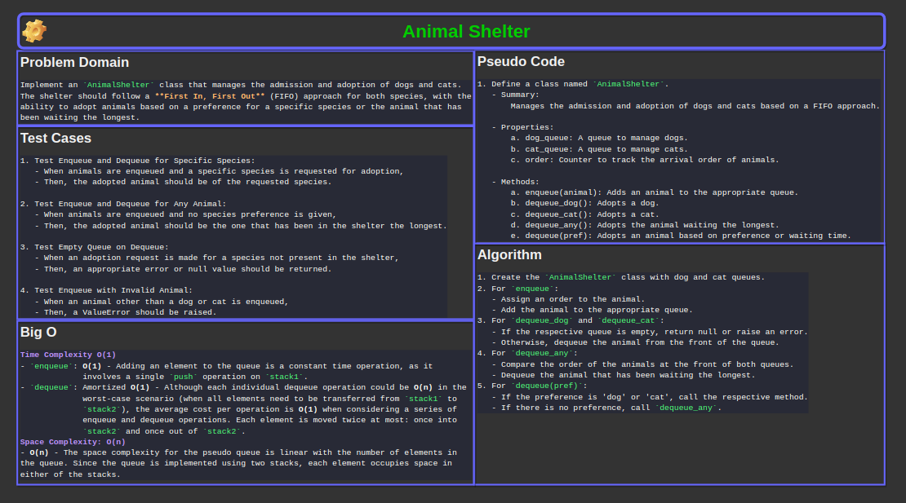
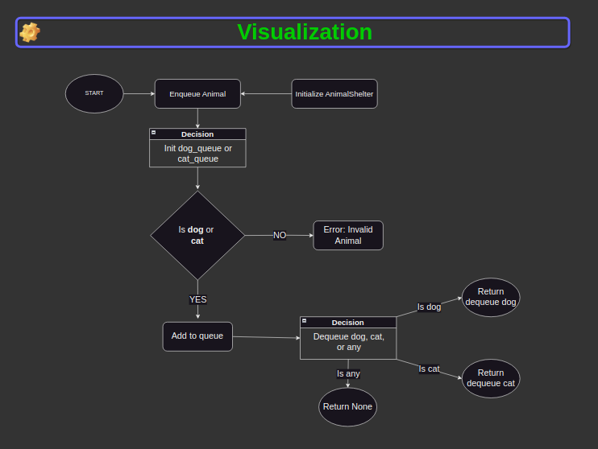

# Code Challenge 12: First-in, First out Animal Shelter

Implement an `AnimalShelter` class that manages the admission and adoption of dogs and cats. The shelter should follow a **First In, First Out** (FIFO) approach for both species, with the ability to adopt animals based on a preference for a specific species or the animal that has been waiting the longest.

[Link to code](./stack_queue_animal_shelter/stack_queue_animal_shelter.py)

## Whiteboard Process




## Approach & Efficiency

- **Approach**:
  - The shelter uses two separate queues, one for dogs and one for cats.
  - Animals are enqueued into their respective queues.
  - Upon adoption (dequeue), the shelter considers the species preference or dequeues the animal that has been in the shelter the longest.

- **Efficiency**:
  - `enqueue`: O(1) time complexity, as it adds to the end of the queue.
  - `dequeue`:
    - For specific species: O(1), dequeues from the front of the queue.
    - For no preference: O(1), compares the front of both queues and dequeues accordingly.

## Solution

1. Create the `AnimalShelter` class with dog and cat queues.
2. For `enqueue`:
   - Assign an order to the animal.
   - Add the animal to the appropriate queue.
3. For `dequeue_dog` and `dequeue_cat`:
   - If the respective queue is empty, return null or raise an error.
   - Otherwise, dequeue the animal from the front of the queue.
4. For `dequeue_any`:
   - Compare the order of the animals at the front of both queues.
   - Dequeue the animal that has been waiting the longest.
5. For `dequeue(pref)`:
   - If the preference is 'dog' or 'cat', call the respective method.
   - If there is no preference, call `dequeue_any`.

### Example Usage

```python
# Example Usage of AnimalShelter Class

# First, create an instance of the AnimalShelter
shelter = AnimalShelter()

# Now, let's create some dog and cat instances
dog1 = Dog("Buddy")
dog2 = Dog("Charlie")
cat1 = Cat("Whiskers")
cat2 = Cat("Mittens")

# Enqueue the animals into the shelter
shelter.enqueue(dog1)
shelter.enqueue(cat1)
shelter.enqueue(dog2)
shelter.enqueue(cat2)

# Adopt a dog from the shelter
adopted_dog = shelter.dequeue("dog")
print(f"Adopted Dog: {adopted_dog.name}")  # Expected output: "Adopted Dog: Buddy"

# Adopt a cat from the shelter
adopted_cat = shelter.dequeue("cat")
print(f"Adopted Cat: {adopted_cat.name}")  # Expected output: "Adopted Cat: Whiskers"

# Adopt any animal (the one that has been in the shelter the longest)
adopted_animal = shelter.dequeue("any")
print(f"Adopted Animal: {adopted_animal.name}")  # Expected output: "Adopted Animal: Charlie"

# Try to adopt a specific type of animal when it's not available
try:
    adopted_dog = shelter.dequeue("dog")
    print(f"Adopted Dog: {adopted_dog.name}")
except InvalidOperationError:
    print("No dogs available for adoption.")

# Finally, adopt the last remaining animal
adopted_animal = shelter.dequeue("any")
print(f"Adopted Animal: {adopted_animal.name}")  # Expected output: "Adopted Animal: Mittens"
```

### Checklist

- [x] Top-level README “Table of Contents” is updated
- [x] README for this challenge is complete
  - [x] Summary, Description, Approach & Efficiency, Solution
  - [x] Picture of whiteboard
  - [x] Link to code
- [x] Feature tasks for this challenge are completed
- [x] Unit tests written and passing
  - [x] “Happy Path” - Expected outcome
  - [x] Expected failure
  - [x] Edge Case (if applicable/obvious)
