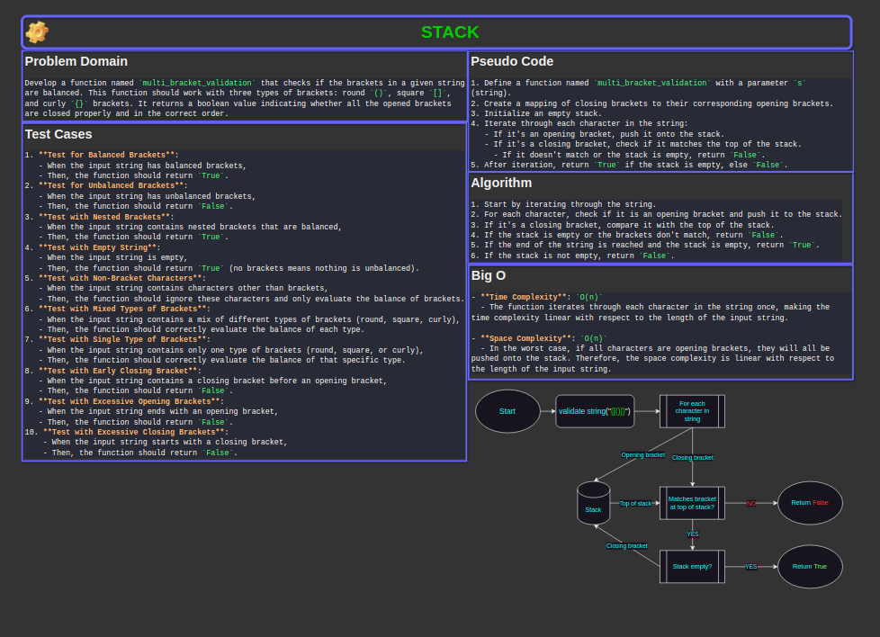

# Code Challenge 13: Multi-bracket Validation

## Problem Domain

Develop a function named `multi_bracket_validation` that checks if the brackets in a given string are balanced. This function should work with three types of brackets: round `()`, square `[]`, and curly `{}` brackets. It returns a boolean value indicating whether all the opened brackets are closed properly and in the correct order.

[Link to code](./stack_queue_brackets/stack_queue_brackets.py)

## Whiteboard Process



## Approach & Efficiency

For the `multi_bracket_validation` function, I used a stack to keep track of opening brackets and ensure that they are correctly matched with their corresponding closing brackets. This approach is well-suited for the problem because a stack naturally follows the Last In, First Out (LIFO) principle, which aligns with the need to match the most recently encountered opening bracket with the next closing bracket.

### Big O Space/Time Complexity

- **Time Complexity**: `O(n)`
  - The function iterates through each character in the string once, making the time complexity linear with respect to the length of the input string.

- **Space Complexity**: `O(n)`
  - In the worst case, if all characters are opening brackets, they will all be pushed onto the stack. Therefore, the space complexity is linear with respect to the length of the input string.

## Solution

1. **Input**: `{[()]}`
   - Process: Validate each bracket pair.
   - Output: `True` (Brackets are balanced)

2. **Input**: `({[})`
   - Process: Validate each bracket pair.
   - Output: `False` (Brackets are not balanced)

### Example Usage

```python
multi_bracket_validation("[]")
# Output: True

multi_bracket_validation("][")
# Output: False

multi_bracket_validation("{}")
# Output: True

multi_bracket_validation("}{")
# Output: False

multi_bracket_validation("()")
# Output: True

multi_bracket_validation(")(")
# Output: False

multi_bracket_validation("{}(){}")
# Output: True

multi_bracket_validation("{([])}")
# Output: True

multi_bracket_validation("[}")
# Output: False
```

### Checklist

- [x] Top-level README “Table of Contents” is updated
- [x] README for this challenge is complete
  - [x] Summary, Description, Approach & Efficiency, Solution
  - [x] Picture of whiteboard
  - [x] Link to code
- [x] Feature tasks for this challenge are completed
- [x] Unit tests written and passing
  - [x] “Happy Path” - Expected outcome
  - [x] Expected failure
  - [x] Edge Case (if applicable/obvious)
