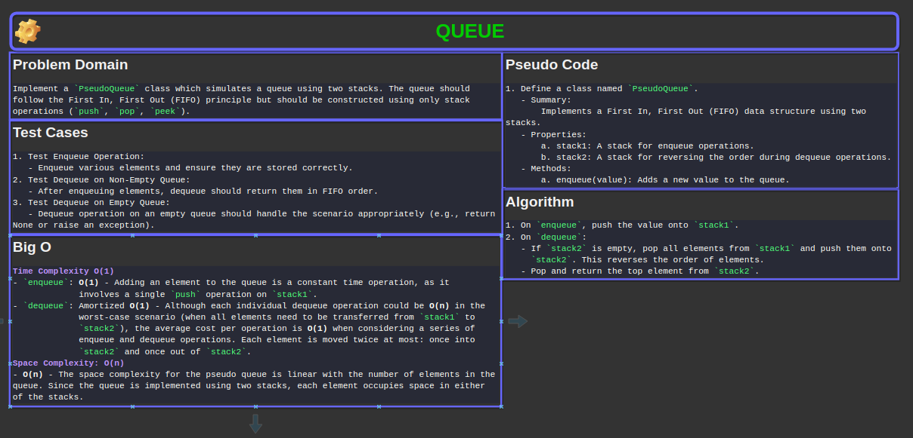
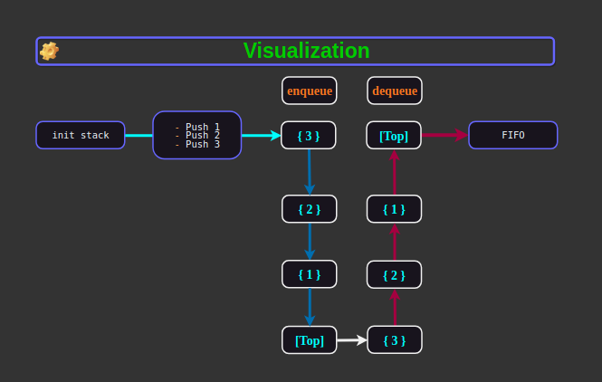

# Code Challenge 11: Implement a Queue using two Stacks

Implement a `PseudoQueue` class which simulates a queue using two stacks. The queue should follow the First In, First Out (FIFO) principle but should be constructed using only stack operations (`push`, `pop`, `peek`).

[Link to code](./stack_and_queue/stack_queue_pseudo.py)

## Whiteboard Process




## Approach & Efficiency

The approach for implementing the `PseudoQueue` class involved using two stacks, `stack1` and `stack2`, to simulate the behavior of a queue.
This design choice was made based on the constraints of the problem, which specified the use of stack operations to achieve a queue-like functionality.

1. **Stacks to Simulate Queues**: A queue operates on a First In, First Out (FIFO) basis, whereas a stack operates on a Last In, First Out (LIFO) basis. By using two stacks, we can reverse the order of elements twice, effectively achieving FIFO behavior.
2. **Efficient Operations**: The use of stacks ensures that each individual operation (either enqueue or dequeue) is efficient.

### Big O Space/Time Complexity Analysis

**Time Complexity**:

- `enqueue`: **O(1)**. This operation involves a simple push onto `stack1`, which is a constant time operation as it doesn't depend on the size of the stack.
- `dequeue`: **Amortized O(1)**. When performing a dequeue operation, if `stack2` is empty, all elements from `stack1` are popped and pushed onto `stack2`. This reversing operation has a time complexity of O(n) in the worst case (when `stack2` is empty). However, since each element is moved only once from `stack1` to `stack2`, the amortized time complexity over multiple enqueue and dequeue operations becomes O(1).

**Space Complexity**:

- **O(n)**. The space complexity for the pseudo queue is linear with respect to the number of elements in the queue. This is because the queue's total size is governed by the sum of elements in both `stack1` and `stack2`, which stores all the elements of the queue.

## Solution

1. On `enqueue`, push the value onto `stack1`.
2. On `dequeue`:
   - If `stack2` is empty, pop all elements from `stack1` and push them onto
     `stack2`. This reverses the order of elements.
   - Pop and return the top element from `stack2`.

### Example Usage

```python
# Create a PseudoQueue instance
queue = PseudoQueue()

# Enqueue some items
queue.enqueue("apple")
queue.enqueue("banana")
queue.enqueue("cherry")

# Now, the queue has "apple", "banana", and "cherry" in this order

# Dequeue an item
first_item = queue.dequeue()  # This should be "apple"

# Dequeue another item
second_item = queue.dequeue()  # This should be "banana"

# The queue now contains only "cherry"
```

### Checklist

- [x] Top-level README “Table of Contents” is updated
- [x] README for this challenge is complete
  - [x] Summary, Description, Approach & Efficiency, Solution
  - [x] Picture of whiteboard
  - [x] Link to code
- [x] Feature tasks for this challenge are completed
- [x] Unit tests written and passing
  - [x] “Happy Path” - Expected outcome
  - [x] Expected failure
  - [x] Edge Case (if applicable/obvious)
