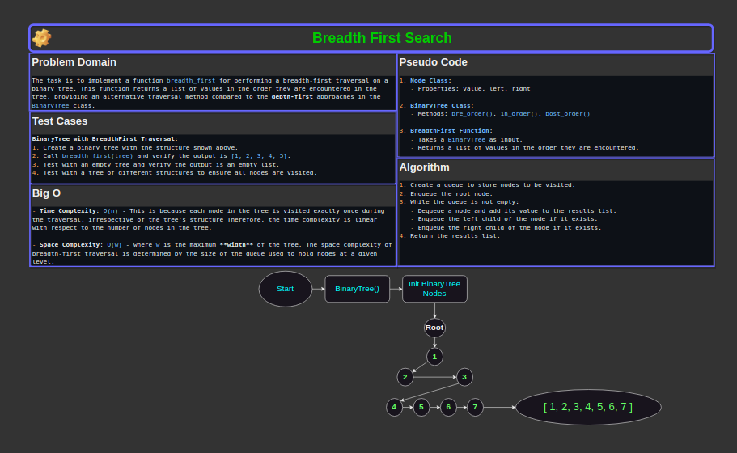

# Code Challenge 17: Tree Breadth First

## Problem Domain

The task is to implement a function `breadth_first` for performing a breadth-first traversal on a binary tree.
This function returns a list of values in the order they are encountered in the tree, providing an alternative
traversal method compared to the **depth-first** approaches in the `BinaryTree` class.

[Link to code](../../code_challenges/tree_breadth_first.py)

## Whiteboard Process

### Version: 1.0

> **NOTE**: To run the tests, cd into the `python` directory. The structure has been cleaned up to allow pytest to do its thing.

## Approach & Efficiency

The `breadth_first` function traverses the tree level by level, starting from the root and moving towards the
leaves. It utilizes a queue to keep track of nodes to be visited and processes each node by appending its value
to a list. Children of each node are enqueued to ensure that nodes at the same level are processed before moving
to the next level.

### Big O Space/Time Complexity

- **Breadth-First BinaryTree Traversal**
  - **Time Complexity**: `O(n)` - This is because each node in the tree is visited exactly once during the traversal, irrespective of the tree's structure
      Therefore, the time complexity is linear with respect to the number of nodes in the tree.
  - **Space Complexity**: `O(w)` - where `w` is the maximum **width** of the tree. The space complexity of breadth-first traversal is determined by the
      size of the queue used to hold nodes at a given level. In the worst case, this can be equal to the maximum width of the tree, which occurs when
      the tree is a **complete binary tree**. In such a case, the last level of the tree contains approximately `n/2` nodes, where `n` is the total number of nodes.

#### Notes:

- The space complexity of the **breadth-first traversal** differs from **depth-first traversals** (which is `O(h)`, where `h` is the height of the tree) because it is not dependent on the height of the tree, but rather on the width at its widest point.
- For a balanced tree, the width `w` can be much smaller than the total number of nodes `n`, but for a complete binary tree or trees with a large number of nodes at a certain level, the space complexity can be significant.
- The **breadth-first traversal** is particularly useful for scenarios where all nodes at a particular depth (*level*) need to be processed before moving to the next level.

## Test Cases

## Solution & Example Usage

1. **Init BinaryTree**:
   - *Input*: `tree = BinaryTree()`
   - *Process*: Initialize an empty binary tree.
   - *Output*: None

2. **Init Nodes**:
   - *Input*: `tree.root = Node(1)`, `tree.root.left = Node(2)`, `tree.root.right = Node(3)`
     - `tree.root.left.left = Node(4)`, `tree.root.left.right = Node(5)`
   - *Process*: Initialize Nodes with values of `1`, `2`, `3`, `4`, `5`.
   - *Output*: None

3. **Breadth-First Traversal**:
   - *Input*: `breadth_first(tree)`
   - *Process*:
     - Create a queue to store nodes to be visited.
     - Start with the root node and enqueue it.
     - While the queue is not empty:
       - Dequeue a node and add its value to the results list.
       - Enqueue the left child of the node if it exists.
       - Enqueue the right child of the node if it exists.
   - *Output*: `[1, 2, 3, 4, 5]`

### Checklist

- [x] Top-level README “Table of Contents” is updated
- [x] README for this challenge is complete
  - [x] Summary, Description, Approach & Efficiency, Solution
  - [x] Picture of whiteboard
  - [x] Link to code
- [x] Feature tasks for this challenge are completed
- [x] Unit tests written and passing
  - [x] “Happy Path” - Expected outcome
  - [x] Expected failure
  - [x] Edge Case (if applicable/obvious)
