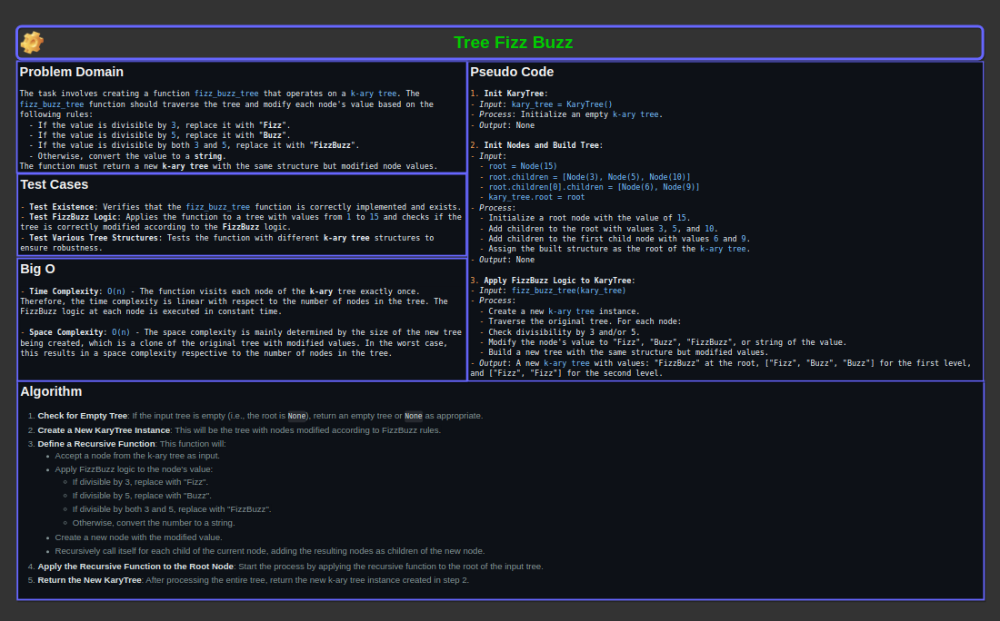

# Code Challenge 18: Fizz Buzz K-ary Tree

## Collaborators

- Stephanie G Johnson
- Latherio Kidd

## Problem Domain

The task involves creating a function `fizz_buzz_tree` that operates on a `k-ary tree`.
The `fizz_buzz_tree` function should traverse the tree and modify each node's value based on the following rules:
    - If the value is divisible by `3`, replace it with "**Fizz**".
    - If the value is divisible by `5`, replace it with "**Buzz**".
    - If the value is divisible by both `3` and `5`, replace it with "**FizzBuzz**".
    - Otherwise, convert the value to a **string**.

The function must return a new **k-ary tree** with the same structure but modified node values.

[Link to code](../../code_challenges/tree_fizz_buzz.py)

## Whiteboard Process



### Version: 1.0

## Approach & Efficiency

The `fizz_buzz_tree` function is designed to traverse a k-ary tree and modify each node's value based on the FizzBuzz rules.
The function operates recursively, starting from the root node and processing each child node in turn. At each node, the function
determines if the value is divisible by 3, 5, both, or neither, and modifies the value accordingly. A new tree with the same
structure is created, where each node's value is replaced with "Fizz", "Buzz", "FizzBuzz", or the string representation of the original value.

## Implementation

The implementation includes two classes:
    - `Node`: Represents a node in the **k-ary tree**.
    - `KaryTree`: Represents the **k-ary tree** itself.

The `fizz_buzz_tree` function takes a `KaryTree` instance and applies the **FizzBuzz** logic to each node.

### Big O Space/Time Complexity

- **FizzBuzz K-ary Tree Transformation**
  - **Time Complexity**: `O(n)` - The function visits each node of the **k-ary** tree exactly once. Therefore, the time complexity is linear with respect to the number of nodes in the tree. The FizzBuzz logic at each node is executed in constant time.
  - **Space Complexity**: `O(n)` - The space complexity is mainly determined by the size of the new tree being created, which is a clone of the original tree with modified values. In the worst case, this results in a space complexity respective to the number of nodes in the tree.
    - Additionally, the recursive calls add to the call stack, but this does not exceed the number of nodes in the tree, maintaining a linear space complexity.

## Solution & Example Usage

1. **Init KaryTree**:
   - *Input*: `kary_tree = KaryTree()`
   - *Process*: Initialize an empty `k-ary tree`.
   - *Output*: None

2. **Init Nodes and Build Tree**:
   - *Input*:
     - `root = Node(15)`
     - `root.children = [Node(3), Node(5), Node(10)]`
     - `root.children[0].children = [Node(6), Node(9)]`
     - `kary_tree.root = root`
   - *Process*:
     - Initialize a root node with the value of `15`.
     - Add children to the root with values `3`, `5`, and `10`.
     - Add children to the first child node with values `6` and `9`.
     - Assign the built structure as the root of the `k-ary tree`.
   - *Output*: None

3. **Apply FizzBuzz Logic to KaryTree**:
   - *Input*: `fizz_buzz_tree(kary_tree)`
   - *Process*:
     - Create a new `k-ary tree` instance.
     - Traverse the original tree. For each node:
       - Check divisibility by 3 and/or 5.
       - Modify the node's value to "Fizz", "Buzz", "FizzBuzz", or string of the value.
       - Build a new tree with the same structure but modified values.
   - *Output*: A new `k-ary tree` with values: "FizzBuzz" at the root, ["Fizz", "Buzz", "Buzz"] for the first level, and ["Fizz", "Fizz"] for the second level.

### Example Usage

```python
# Create a k-ary tree
root = Node(15)
root.children = [Node(3), Node(5), Node(7)]
kary_tree = KaryTree(root)

# Apply FizzBuzz logic to the tree
new_tree = fizz_buzz_tree(kary_tree)

# Traverse and print new_tree values...
```

## Testing

The functionality of `fizz_buzz_tree` is verified through a series of tests using `pytest`. Key test cases include:

- **Test Existence**: Verifies that the `fizz_buzz_tree` function is correctly implemented and exists.
- **Test FizzBuzz Logic**: Applies the function to a tree with values from `1` to `15` and checks if the tree is correctly modified according to the **FizzBuzz** logic.
- **Test Various Tree Structures**: Tests the function with different **k-ary tree** structures to ensure robustness.

To run the tests, use the following command:

```bash
pytest test_tree_fizz_buzz.py
```

### Checklist

- [x] Top-level README “Table of Contents” is updated
- [x] README for this challenge is complete
  - [x] Summary, Description, Approach & Efficiency, Solution
  - [x] Picture of whiteboard
  - [x] Link to code
- [x] Feature tasks for this challenge are completed
- [x] Unit tests written and passing
  - [x] “Happy Path” - Expected outcome
  - [x] Expected failure
  - [x] Edge Case (if applicable/obvious)
