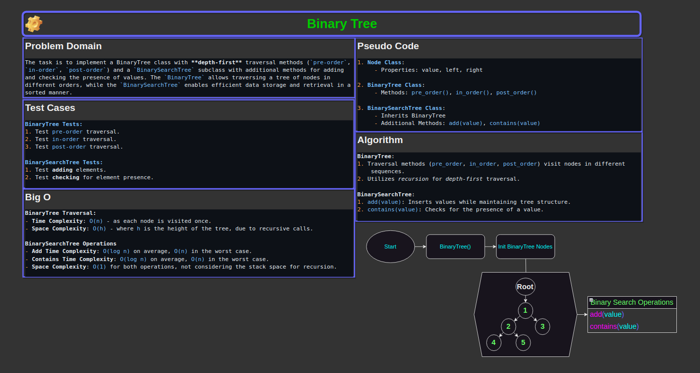
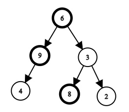

# Code Challenge 16: Trees

## Problem Domain

The task is to implement a BinaryTree class with **depth-first** traversal methods (`pre-order`, `in-order`, `post-order`) and a `BinarySearchTree` subclass with additional methods for adding and checking the presence of values. The `BinaryTree` allows traversing a tree of nodes in different orders, while the `BinarySearchTree` enables efficient data storage and retrieval in a sorted manner.

[Link to code](./trees.py)

## Whiteboard Process

### Version 2:

The task is to implement a method that searches and returns the Maximum Value in a Binary Tree.

## Approach & Efficiency

The `BinaryTree` class implements standard **depth-first** traversals, essential for various tree-based operations. The `BinarySearchTree` extends `BinaryTree` with a sorted structure, ensuring efficient addition and search operations.

### BinaryTree:

- **pre_order**: Traverses the tree in a root-left-right sequence.
- **in_order**: Traverses the tree in a left-root-right sequence.
- **post_order**: Traverses the tree in a left-right-root sequence.

### BinarySearchTree:

- **add**: Inserts a value into the tree, maintaining the binary search tree property.
- **contains**: Checks if a value is present in the tree.

### Big O Space/Time Complexity

- **BinaryTree Traversal**
  - **Time Complexity**: `O(n)` - as each node is visited once.
  - **Space Complexity**: `O(h)` - where `h` is the height of the tree, due to recursive calls.

- **BinarySearchTree Operations**
  - **Add Time Complexity**: `O(log n)` on average, `O(n)` in the worst case.
  - **Contains Time Complexity**: `O(log n)` on average, `O(n)` in the worst case.
  - **Space Complexity**: `O(1)` for both operations, not considering the stack space for recursion.

- **Find_Maximum_Value Function**
  - **Time Complexity**: The time complexity remains `O(n)`, where `n` is the number of nodes in the tree.
    - Each node is visited once during the traversal to compare its value.
  - **Space Complexity**: The space complexity is `O(h)`, where `h` is the height of the tree. This is due
    to the recursive stack space used during the depth-first traversal.
    - In a balanced tree, this would be `O(log n)`, but in the worst case (a completely unbalanced tree), it could be `O(n)`.

## Test Cases

### BinaryTree Tests:

- Test `pre-order` traversal.
- Test `in-order` traversal.
- Test `post-order` traversal.

### BinarySearchTree Tests:

- Test **adding** elements.
- Test **checking** for element presence.

### Find Maximum Value Tests

- Test **checking** for element with largest value.

## Solution & Example Usage

1. **Init BinaryTree**:
   - Input: `tree = BinaryTree()`
   - Process: Initialize an empty binary tree.
   - Output: None

2. **Init Nodes**:
   - Input: `tree.root = Node(1)`, `tree.root.left = Node(2)`, `tree.root.right = Node(3)`
     - `tree.root.left.left = Node(4)`, `tree.root.left.right = Node(5)`
   - Process: Initialize Nodes with a values of `1`, `2`, `3`, `4`, `5`.
   - Output: None

3. **Pre-Order**:
   - Input: `tree.pre_order()`
   - Process: Performs a pre-order traversal of the binary tree.
   - Output: `[1, 2, 4, 5, 3]`

4. **In-Order**:
   - Input: `tree.in_order()`
   - Process: Performs an in-order traversal of the binary tree.
   - Output: `[4, 2, 5, 1, 3]`

5. **Post-Order**:
   - Input: `tree.post_order()`
   - Process: Performs a post-order traversal of the binary tree.
   - Output: `[4, 2, 5, 1, 3]`

6. **Binary Search Tree**:
   - Input: `bst = BinaryTree()`
   - Process: Instantiate BinarySearchTree subclass.
   - Output: None

7. **Add**:
   - Input:
      `bst.add(5)`,
      `bst.add(3)`,
      `bst.add(7)`,
      `bst.add(2)`,
      `bst.add(4)`,
      `bst.in_order()`
   - Process: Adds a new nodes with the specified value to the binary search tree and calls `in_order` method on it.
   - Output: `[2, 3, 4, 5, 7]`

8. **Contains**:
   - Input:
      `bst.contains(5)`,
      `bst.contains(3)`,
      `bst.contains(7)`,
      `bst.contains(6)`,
      `bst.contains(8)`,
      `bst.contains(0)`,
   - Process: Checks whether the binary search tree contains a given value.
   - Output: `True` or `False` respective of value presence.

9. **Find Maximum Value**:
   - Input: `bst.find_maximum_value()`
   - Process: Recurses through binary tree to find maximum value by comparing current max to nodes.
   - Output: `The maximum value` or `None` respective of the tree's existence.

### Checklist

- [x] Top-level README “Table of Contents” is updated
- [x] README for this challenge is complete
  - [x] Summary, Description, Approach & Efficiency, Solution
  - [x] Picture of whiteboard
  - [x] Link to code
- [x] Feature tasks for this challenge are completed
- [x] Unit tests written and passing
  - [x] “Happy Path” - Expected outcome
  - [x] Expected failure
  - [x] Edge Case (if applicable/obvious)
